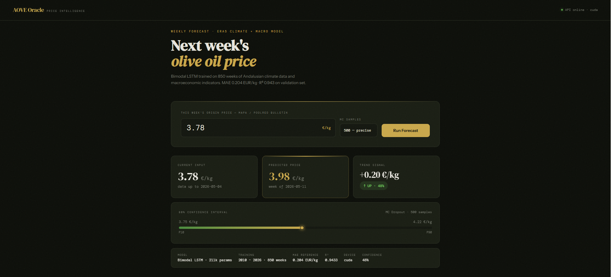
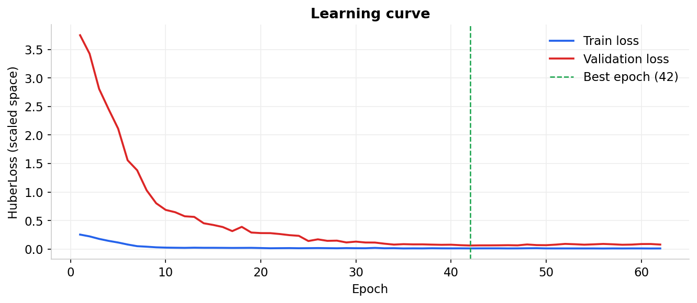
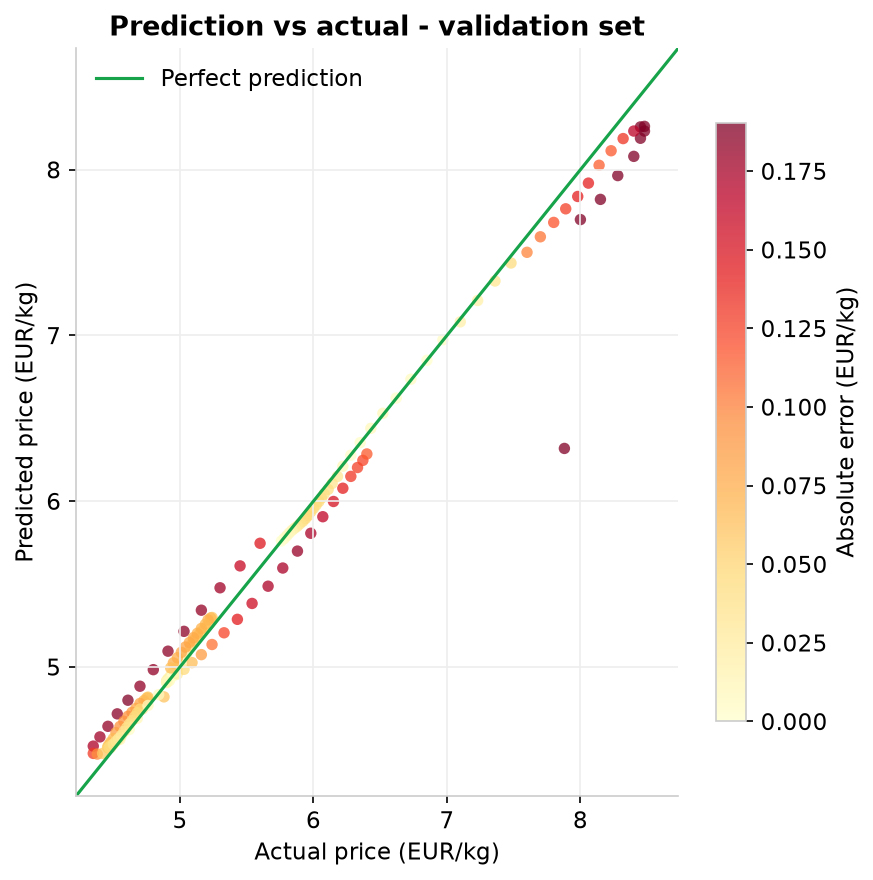
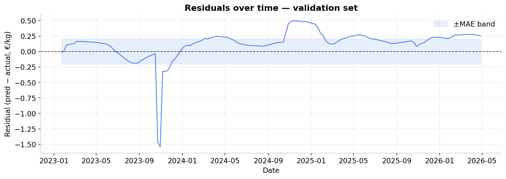
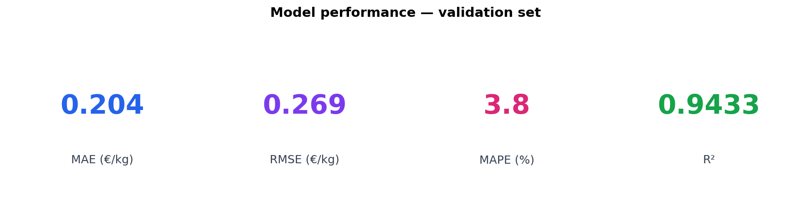
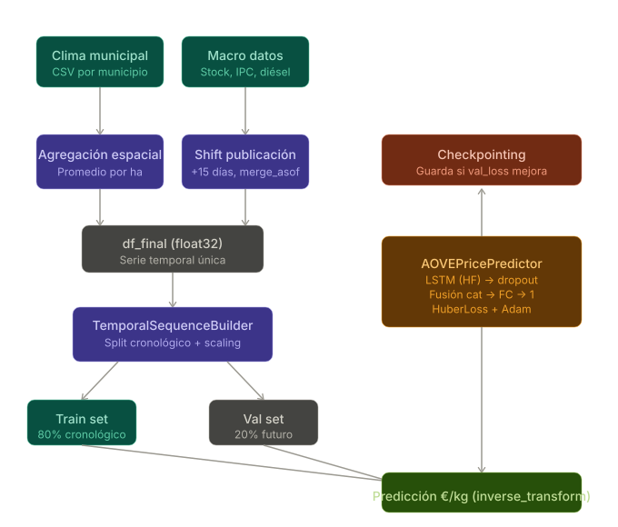

# AOVE Oracle — Weekly EVOO Price Predictor




---

A production-grade weekly forecast system for Extra Virgin Olive Oil (EVOO) origin prices in Andalusia, Spain. The model ingests current market price, spatially aggregated climate data and macroeconomic indicators, and returns a point prediction with an 80% confidence interval for the following week.

---

## Results

| Metric | Validation set |
|---|---|
| MAE | **0.204 EUR/kg** |
| RMSE | 0.269 EUR/kg |
| MAPE | **3.78 %** |
| R² | **0.943** |

Validation was performed on a chronological hold-out (last 20% of the time series, ~2 years). No data leakage — scalers are fitted exclusively on the training split.

### Diagnostic plots

| Learning curve | Predicted vs Actual |
|---|---|
|  |  |

| Residuals | Metrics dashboard |
|---|---|
|  |  |

---

## Architecture



### Model: Bimodal LSTM

The network has two input branches that are fused before the output head:

- **High-frequency branch (LSTM)** — a 2-layer LSTM with hidden size 128 processes a sliding window of 104 weeks (2 years) of climate features: rainfall, max temperature, water deficit and seasonal encoding (sin/cos of ISO week).
- **Macro branch (MLP)** — the latest week's macroeconomic snapshot (CPI, diesel price, olive stock delta, olive surface delta, lagged AOVE price) is concatenated with the LSTM's last hidden state and passed through a 3-layer fully connected head.

Monte Carlo Dropout (Gal & Ghahramani, 2016) provides the confidence interval: 200 stochastic forward passes with dropout active approximate the predictive posterior.

### Data pipeline (ETL)

- **Climate** — ERA5 weekly observations from 13 Andalusian municipalities, spatially aggregated by cultivated olive surface (weighted average).
- **Macro** — MAPA/POOLred official bulletins: origin prices, olive stocks, planted surface variation, national CPI and diesel price. A 15-day publication lag is modelled explicitly with `merge_asof`.
- The user supplies only the current week's POOLred price at inference time; everything else is pre-loaded.

---

## Repository layout

```
.
├── api.py                      # FastAPI REST server (self-contained)
├── AOVE_predictor.py           # CLI inference interface
├── dashboard.html              # Single-page frontend (served by FastAPI)
├── requirements.txt
├── Pipeline_architecture_AOVE.svg
├── notebooks/
│   ├── AOVE_training.ipynb     # Full training pipeline (model + visualisations)
│   ├── AOVE_data_prepare.ipynb # ETL and dataset assembly
│   ├── AOVE_predictor.ipynb    # Interactive prediction notebook
│   └── AOVE_api.ipynb          # API usage examples
├── docs/
│   └── Use_example.png
├── Docker/
│   ├── Dockerfile
│   ├── docker-compose.yml
│   ├── requirements.txt
│   └── .dockerignore
└── AOVE_model/
    ├── 01_learning_curve.png
    ├── 02_pred_vs_actual.png
    ├── 03_residuals.png
    └── 04_metrics_dashboard.png
```

> The trained checkpoint (`best_aove_model.pth`) and proprietary datasets are **not included**. See [MODEL_NOT_INCLUDED.md](MODEL_NOT_INCLUDED.md).

---

## API

### Run locally

```bash
pip install fastapi uvicorn
uvicorn api:app --reload --port 8000
```

### Run with Docker

```bash
cd Docker
docker compose up --build
```

The dashboard is available at `http://localhost:8000/dashboard`.  
Swagger UI at `http://localhost:8000/docs`.

### POST `/predict`

```json
{
  "current_price": 4.85,
  "mc_samples": 200
}
```

```json
{
  "status": "success",
  "predicted_price": 4.71,
  "confidence_interval": { "low_80": 4.52, "high_80": 4.89 },
  "trend_signal": "DOWN",
  "confidence_pct": 62,
  "prediction_week": "2025-11-17",
  "mae_reference": 0.204
}
```

### CLI

```bash
python AOVE_predictor.py \
  --model    ./AOVE_model/best_aove_model.pth \
  --climate  ./data/climate_dataset.csv \
  --macro    ./data/macro_dataset.csv
```

---

## Live demo

> Deployment coming soon — the API will be hosted on [Hugging Face Spaces](https://huggingface.co/spaces), [Render](https://render.com) or [Railway](https://railway.app). A public URL will appear here once live.

---

## Tech stack

| Layer | Library |
|---|---|
| Deep learning | PyTorch 2.3 |
| Data processing | pandas, NumPy, scikit-learn |
| API | FastAPI + Uvicorn / Gunicorn |
| Containerisation | Docker + docker-compose |

---

## Citation
If you use this work in your research, please cite:

@software{herruzo2026aove,
  author  = {Herruzo, Juan Manuel},
  title   = {AOVE Oracle: Weekly EVOO Price Predictor},
  year    = {2026},
  url     = {[https://github.com/Juanmaherruzo/AOVE-price-predictor](https://github.com/Juanmaherruzo/AOVE-price-predictor)}
}

---

## Contact

**Juan Manuel Herruzo**  
juanmherruzo@gmail.com

For commercial licensing, API access or research collaboration, get in touch.
